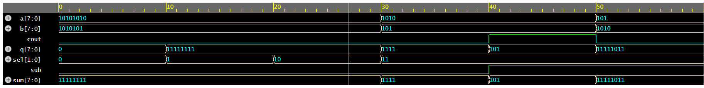

#  8-bit Carry Look-Ahead ALU (Verilog)

A high-performance **8-bit Arithmetic Logic Unit (ALU)** designed using a **Carry Look-Ahead (CLA) Adder** for fast arithmetic operations. This project demonstrates efficient digital design principles and modular Verilog implementation.

---

##  Features

*  **Fast Addition/Subtraction** using Carry Look-Ahead Adder
*  Supports **8-bit operations**
*  Arithmetic & Logical Operations:

  * Addition
  * Subtraction
  * Bitwise AND
  * Bitwise OR
  * Bitwise XOR
*  Modular design (scalable architecture)
*  Fully verified using a testbench
*  Waveform analysis included

---

##  Architecture

The ALU is built using:

* **Carry Look-Ahead Adder (CLA)** for fast carry computation
* Control logic using `sel` and `sub` signals
* Separate handling for arithmetic and logical operations

###  Control Signals

| sel | sub | Operation   |
| --- | --- | ----------- |
| 11  | 0   | Addition    |
| 11  | 1   | Subtraction |
| 01  | 0   | Bitwise OR  |
| 00  | 0   | Bitwise AND |
| 10  | 0   | Bitwise XOR |

---

##  Project Structure

```
Carry-Look-Ahead-ALU/
│
├── 8bit_CLA_ALU_design.sv      # Main ALU design
├── 8bit_CLA_ALU_testbench.sv   # Testbench for verification
├── 8bit_CLA_ALU_waveform.png   # Simulation waveform
└── README.md                   # Project documentation
```

---

##  Simulation

The design is verified using a Verilog testbench.

### Steps:

1. Compile the design and testbench
2. Run simulation
3. View waveform using GTKWave / EPWave

---

##  Waveform Output

The waveform verifies correct functionality of all operations:

*  Addition produces correct sum
*  Subtraction works using two's complement
*  Logical operations produce expected outputs



---

##  Key Concepts Used

* Carry Look-Ahead Logic (Generate & Propagate)
* Two’s Complement Arithmetic
* Modular Verilog Design
* Testbench-based Verification

---

##  Future Improvements

* Add **flags** (Zero, Carry, Overflow, Sign)
* Convert to **parameterized ALU (N-bit scalable)**
* Integrate into a **simple CPU design**
* Add **self-checking testbench**

---

##  Author

**Adesh Shukla**

* Passionate about Digital Design & VLSI
* Exploring Verilog, SystemVerilog, and Computer Architecture

---

##  If you found this useful

Give this repo a  and feel free to fork!

---
